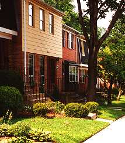

What everyone notices first about Pinewood Greens is the amazing amount of green space not found in most townhouse communities.

Our commons are ample, with wide open spaces for Saturday afternoon football games and room to let the kids (and maybe the adults) to work off a little energy.

Our 306 homes are two or three stories high, of brick and aluminum siding construction, painted in colonial colors reminiscent of Williamsburg. With three bedrooms and two full baths (sometimes more), one or more powder rooms, living rooms, dining rooms, and family rooms, our houses quickly become homes when the boxes are unpacked.

The builder gave us three models to choose from:

*   [The Pinehurst](documents/floorplans/pinehurst.pdf)
*   [The Oakmont](documents/floorplans/oakmont.pdf)
*   [The Doral](documents/floorplans/doral.pdf)

Each homeowner takes care of their home, as well as the fence and the front and back yard. Please remember that the [Covenants](documents/legal/Declaration_of_Covenants.pdf) (a part of the deed of your property under Virginia law) require you to maintain the exterior of your property, and also require you to submit an [Application for Architectural Review](https://skydrive.live.com/redir?resid=529E6218CA92DA58%211560) if you want to make a change to the exterior of your home.

See the [forms](forms.html) page for more information, including architectural guidelines.
